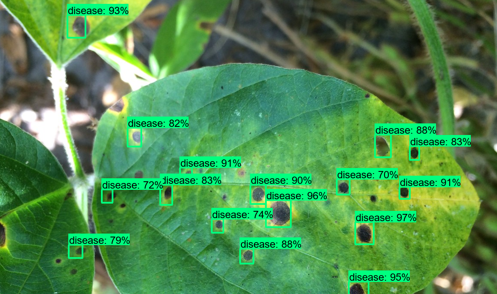

# Soyaben-leaf-disease-detection using Tensorflow
Soybean leaf disease is the most common disease(Bacterial Diseases) in our country for planting soybeans. Farmer loss their most valuable asset and didn't generate money as well as they expected when the plant got affected. From there, I decided I want to do something for them to solve this. I collect 13k affected images from the field and work with these images for preprocessing and data annotation and model building. Sounds good to see when it give me good accuracy.

##### I used 1 class to predict for Bacterial Diseases named as 'disease'

#### Requiremnts

- Protobuf 3.0.0
- Python-tk
- Pillow 1.0
- lxml
- tf Slim (which is included in the "tensorflow/models/research/" checkout)
- Matplotlib
- Tensorflow
- Cython
- contextlib2
- fasterRCNN

#### Tensorflow-model
The TensorFlow Model Garden is a repository with a number of different implementations of state-of-the-art (SOTA) models and modeling solutions for TensorFlow users. We aim to demonstrate the best practices for modeling so that TensorFlow users can take full advantage of TensorFlow for their research and product development. For, more info click the following link: [Tensorflow Model](https://github.com/tensorflow/models/tree/master/research/object_detection).

## Fresh soyabean leaf

## Affected leaf

## Predicted output

##### Contact:
rakib.cse014@gmail.com

#### References:
[Tensorflow-API](https://github.com/tensorflow/models/tree/master/research/object_detection).
